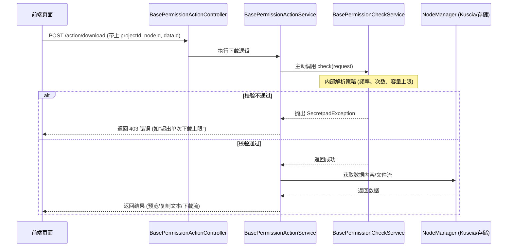

# 基础权限操作接口执行方案 (V2.1)

## 1. 业务流程图

## 2. 核心设计说明

### 请求模型统一
将校验所需信息（用户、角色）与执行所需坐标（节点、数据ID）合并。`BasePermissionCheckRequest` 现在承载所有上下文。

### 后端内化逻辑
所有操作接口内部强制先调校验服务。

## 3. 校验维度分配

| 维度 | 查看 (View) | 复制 (Copy) | 下载 (Download) |
| :--- | :---: | :---: | :---: |
| **enabled** | ✅ | ✅ | ✅ |
| **rateLimit** | ✅ | ✅ | ✅ |
| **maxTotalCount** | ✅ | ✅ | ✅ |
| **maxSingleLimit** | ➖ (采样查看) | ➖ (文本复制) | ✅ (严格限制) |
| **maxTotalLimit** | ➖ | ➖ | ✅ (严格限制) |

## 4. 详细逻辑实现

### 查看 (View)
- **逻辑**：从节点读取前 100 行数据（CSV 采样），返回 JSON。

### 复制 (Copy)
- **逻辑**：读取数据内容，返回完整文本，供前端展示供用户复制。

### 下载 (Download)
- **逻辑**：启动流式传输，设置 HTTP Header 为 attachment 触发浏览器下载。

## 5. 关键组件变更

- **[MODIFY]** `BasePermissionCheckRequest`: 增加 `nodeId`, `domainDataId` 字段。
- **[NEW]** `BasePermissionActionController`: 包含 `/view`, `/copy`, `/download` 接口。
- **[NEW]** `BasePermissionActionService`: 协调校验逻辑与 IO 读取逻辑。
